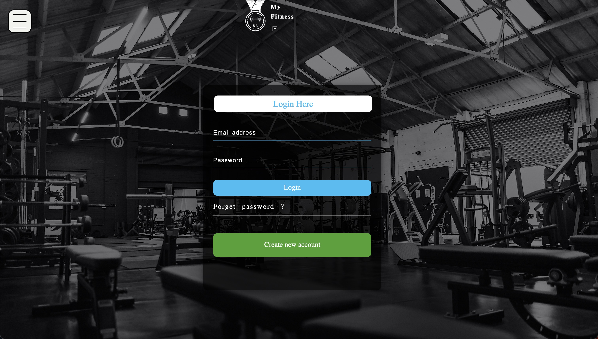

# MyFitness
A simple gym website, built with HTML, CSS and JavaScript
### Some screenshots from the website

  
  
<em>Simulation screenshot</em>

  
  
<em>Blynk Mobile Interface, and notification</em>

  
  
<em>Blynk Mobile Interface, and notification</em>

